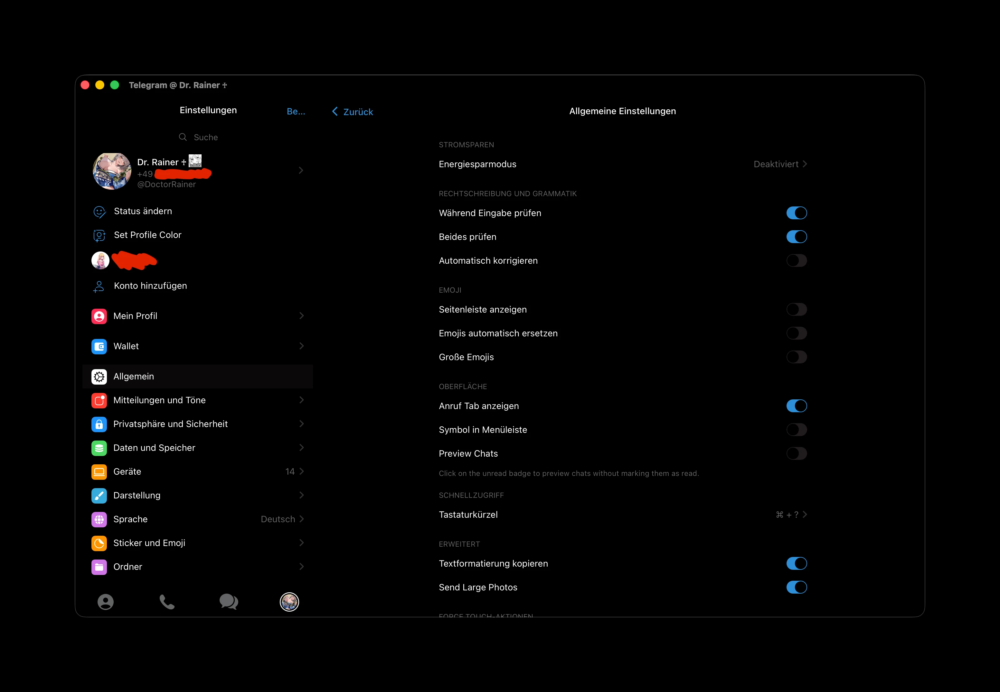
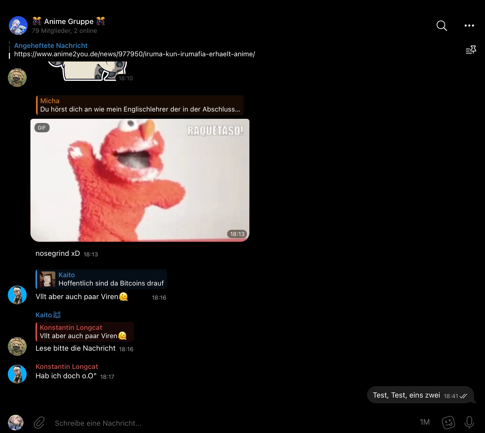

# AMOLED Telegram Theme – macOS Native

Pure black AMOLED theme for the native Telegram client on macOS  
Maximum battery life • High contrast • No garbage

## Features
- True #000000 background everywhere possible  
- Subtle dark gray outgoing bubbles (#1e1e1e)  
- Incoming messages blend into black (#000000)  
- Sharp white text → your messages clearly stand out  
- Clean, aggressive, no-nonsense look

## Installation
1. Follow the link https://t.me/addtheme/sJy4ZMMBxXYbd  
2. Apply
3. Restart Telegram

## Installation (manual)
1. Download `AMOLED-macOS.palette`  
2. Telegram → Settings → Appearance → ••• button → New Theme -> Right Click on this new theme -> Edit -> Upload from File... -> Save  
3. Restart Telegram

## Preview

## Notes
- Best on OLED / mini-LED displays  
- Zero rainbow colors, zero bullshit  
- Made for clarity and performance

Dr. Rainer Reinhardt | 2026
